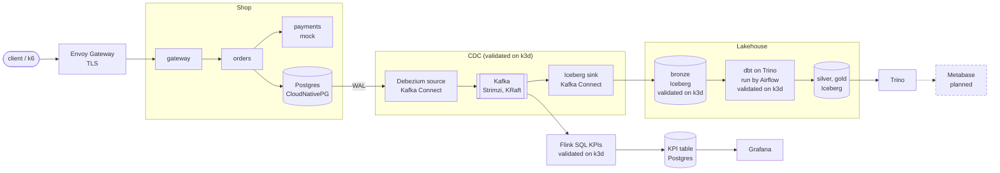
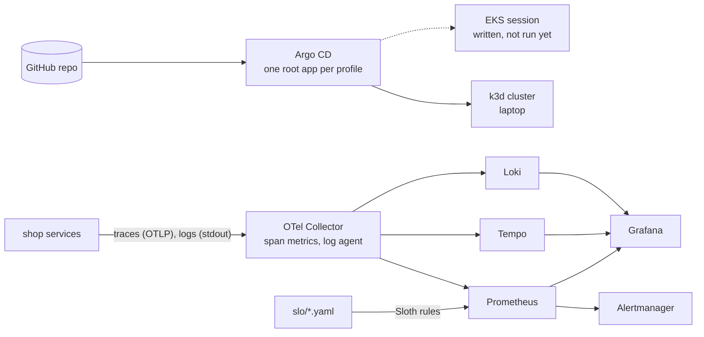

# shopflow

[](https://github.com/winthebest/shopflow/actions/workflows/ci.yml)
[](https://github.com/winthebest/shopflow/actions/workflows/platform-ci.yml)
[](https://github.com/winthebest/shopflow/actions/workflows/sre-ci.yml)
[](https://github.com/winthebest/shopflow/actions/workflows/data-ci.yml)
[](https://github.com/winthebest/shopflow/actions/workflows/infra-ci.yml)

A data platform built and operated end to end. A three-service shop writes orders to Postgres; Debezium streams
every change through Kafka into Apache Iceberg; dbt, Airflow and Trino turn the raw changes into analytics tables.
The stack is deployed by GitOps (Argo CD) on a local k3d cluster, watched by SLOs and alerts, and written to run
on short-lived AWS EKS sessions under a hard cost budget.

This is a portfolio project. Each claim below links to the measurement, test or decision record behind it. Work
that is not finished is marked *in progress* or *planned*.

**What it demonstrates**

- **DevOps:** GitOps with composable profiles, a Gateway API edge with TLS, encrypted secrets in Git, OpenTofu
  for AWS with CI that can plan but never apply.
- **SRE:** SLOs as code with multi-window burn-rate alerts, unit-tested detection times, one runbook per alert,
  load and soak tests, and a postmortem of a real incident.
- **Data engineering:** log-based CDC into an Iceberg lakehouse, bronze → silver → gold with dbt, Airflow
  orchestration, data contracts checked in CI, and CDC lag and gold freshness SLOs for the pipeline.

[Architecture](#architecture) · [Highlights](#highlights-with-evidence) · [Tech stack](#tech-stack) ·
[Quickstart](#quickstart) · [Repository map](#repository-map) · [Status](#status-and-roadmap) ·
[Design decisions](#design-decisions) · [Docs](#documentation)

## Architecture

**Data path.** Orders flow from the shop into Postgres, out through CDC, and into Iceberg tables that dbt
refines and Trino serves.



Iceberg data lives in SeaweedFS behind an Apache Polaris REST catalog (S3 and AWS Glue on AWS). CDC into
bronze, the Flink KPI job (profile `rt`) and dbt + Airflow (profile `batch`) are validated end to end on a local k3d
cluster, not yet on AWS. Metabase is planned.

**Platform and observability.** After the bootstrap, Git is the only deploy path. Every request is traced, and
the SLIs come from those traces.



## Highlights with evidence

| Claim | Evidence |
|---|---|
| Gate 2, run on 2026-10-10 from `main`: `make up` on a fresh k3d cluster (warm image caches) ready in 301 s (`core,obs`) and 314 s (`core,obs-lite,data`); k6 at 10 checkouts/s with 0 errors, p95 72–77 ms; CDC `c,u,d` into bronze in 34–68 s; NetworkPolicy probe 34/34; Tempo peak memory at 26% of its limit | [Gate 2 record](docs/gates/2026-10-10-gate-2.md) |
| Checkout p95 **72 ms** at 20 checkouts/s on docker compose; 0 HTTP errors; every acknowledged order found in Postgres, none left pending | [docs/perf-baseline.md](docs/perf-baseline.md) |
| Checkout SLOs as code: **99.5%** availability and **99% under 300 ms** over 28 days, with multi-window burn-rate pages and tickets | [docs/slo/checkout.md](docs/slo/checkout.md), [slo/checkout.yaml](slo/checkout.yaml) |
| Detection times proven by promtool unit tests: a page about 9 minutes after every checkout turns slow, no NaN when the lab is idle, a ticket when the SLI goes missing | [slo/tests/checkout.test.yaml](slo/tests/checkout.test.yaml) |
| Soak on k3d at 10 checkouts/s: a **97-minute** clean window with p99 ≈ 100 ms. No 2-hour window was clean (the laptop slept). Page timing on the cluster is moved to Phase 7 | [Measured results](docs/slo/checkout.md#measured-results) |
| A real incident during the soak: both SLO tickets fired, the first within a minute. The postmortem covers budget used, timeline and what failed (the alert reached nobody) | [Postmortem](docs/postmortems/2026-10-09-checkout-slow-noisy-neighbor.md) |
| SLIs come from span metrics in one OTel pipeline, so they kept counting while Tempo was crash-looping | [ADR 0301](docs/adr/0301-otel-collector-single-pipeline.md), [postmortem](docs/postmortems/2026-10-09-checkout-slow-noisy-neighbor.md#what-went-well) |
| GitOps fails closed: CI builds every profile and fails if any app would not follow the deployed Git revision | [gitops.md §4](docs/contracts/gitops.md#4-profiles), [platform-validate.sh](scripts/platform-validate.sh) |
| Security baseline: Pod Security `restricted` in the core namespaces (`baseline` for data and Airflow, `privileged` for observability), default-deny NetworkPolicies in all of them, SOPS-encrypted secrets, admin UIs only through port-forward, Kafka over TLS + SCRAM, gitleaks, images pinned by digest | ADRs [0208](docs/adr/0208-psa-and-network-policies.md), [0204](docs/adr/0204-sops-ksops-local-secrets.md), [0205](docs/adr/0205-admin-ui-port-forward-only.md), [0404](docs/adr/0404-kafka-tls-scram-acl.md) |
| CDC end to end on k3d (`core,obs-lite,data`): the snapshot put 100/100 customers in bronze; one order's insert, update and delete reached bronze as `c,u,d` in **47 s** (target ≤ 120 s); bronze heartbeat freshness 27 s; Debezium 3 ms behind the source when idle; ~10.6 GB RAM. Not run on AWS yet | [PR #122](https://github.com/winthebest/shopflow/pull/122), [data-cluster-check.sh](scripts/data-cluster-check.sh) |
| Realtime KPIs with Flink SQL on k3d (`core,obs-lite,data,rt`): under k6 at 10 checkouts/s, a minute's KPIs are in Postgres 34 s after its window closes (67 s after the load starts); per-minute order counts match the `orders` table exactly; the Grafana KPI panels show data; ~12.6 GB RAM, so `rt` runs as an exclusive slot. Known gap: the last minute stays open when orders stop. Not run on AWS yet | [ADR 0415, Consequences](docs/adr/0415-flink-sql-realtime-kpis.md#consequences) |
| dbt and Airflow on k3d (`core,obs-lite,data,batch`): `dbt_build` ran 28/28 tasks on Trino, 5 min 42 s on empty schemas and 44–46 s for later runs; after 601 k6 checkouts, gold matches Postgres exactly (601 orders: 589 paid, 12 failed; paid revenue 52,844.70 on both sides); orders deleted in bronze are absent from silver and gold. The gold-freshness SLO is not yet measured on a cluster (it needs a cluster up for more than 2 hours); only its promtool tests cover it. Not run on AWS yet | [ADR 0414, Consequences](docs/adr/0414-airflow3-local-executor-cosmos.md#consequences) |
| AWS guardrails: a budget that excludes credits, a deny action at $25, sessions bounded by a lease and two reapers. Cost *estimate* $0.30–0.45/h, not yet measured | [docs/cost.md](docs/cost.md), ADRs [0510](docs/adr/0510-cost-guardrails-exclude-credits.md), [0501](docs/adr/0501-ephemeral-env-with-lease.md) |

## Tech stack

| Area | Tools | Decisions |
|---|---|---|
| Local platform | k3d, Argo CD (app-of-apps), Helm + Kustomize, Envoy Gateway (Gateway API), cert-manager, CloudNativePG, SOPS + age + KSOPS | [0200](docs/adr/0200-k3d-over-kind.md), [0201](docs/adr/0201-argocd-over-flux.md), [0202](docs/adr/0202-gateway-api-envoy-gateway.md), [0203](docs/adr/0203-cnpg-over-rds.md), [0204](docs/adr/0204-sops-ksops-local-secrets.md) |
| Cloud | OpenTofu, EKS on Graviton spot, no NAT gateway, External Secrets + SSM, images in GHCR | [0500](docs/adr/0500-opentofu-over-terraform.md), [0503](docs/adr/0503-no-nat-public-subnets.md), [0505](docs/adr/0505-graviton-spot-nodes.md), [0507](docs/adr/0507-ghcr-over-ecr.md), [0508](docs/adr/0508-ssm-over-secrets-manager.md) |
| CI | GitHub Actions per area: ruff, pytest + testcontainers, kubeconform, promtool, sqlfluff, tflint, trivy, zizmor, shellcheck, gitleaks | [0509](docs/adr/0509-ci-cannot-apply-oidc-scoping.md) |
| Observability, SLO | OpenTelemetry Collector, Prometheus + Alertmanager, Loki, Tempo, Grafana, Sloth, k6 | [0300](docs/adr/0300-slo-tooling-sloth.md), [0301](docs/adr/0301-otel-collector-single-pipeline.md), [0302](docs/adr/0302-observability-backends-chart-sources.md) |
| Ingest | Debezium, Kafka on Strimzi (KRaft), Iceberg sink connector | [0400](docs/adr/0400-kafka-kraft-debezium-iceberg-versions.md), [0403](docs/adr/0403-strimzi-over-msk.md), [0405](docs/adr/0405-json-converter-no-registry.md), [0406](docs/adr/0406-append-only-bronze-cdc-epoch.md) |
| Lakehouse | Apache Iceberg v2, Apache Polaris, SeaweedFS (AWS: S3 + Glue), Trino | [0407](docs/adr/0407-iceberg-format-v2.md), [0408](docs/adr/0408-iceberg-rest-catalog-polaris.md), [0409](docs/adr/0409-seaweedfs-over-minio.md), [0410](docs/adr/0410-trino-catalogs-per-identity.md), [0506](docs/adr/0506-glue-catalog-on-aws.md) |
| Transform, serve | dbt Core, Airflow 3 + Cosmos, custom freshness exporter, Flink SQL, Metabase (planned) | [0412](docs/adr/0412-dbt-core-over-sqlmesh.md), [0414](docs/adr/0414-airflow3-local-executor-cosmos.md), [0402](docs/adr/0402-freshness-exporter-custom.md), [0415](docs/adr/0415-flink-sql-realtime-kpis.md) |
| Shop | Python 3.12, FastAPI, uv workspace, Alembic, data contracts checked in CI | [0100](docs/adr/0100-app-language-python-fastapi.md), [0101](docs/adr/0101-data-contracts-in-ci.md) |

## Quickstart

Requirements: Docker with Compose, GNU Make, and [k6](https://k6.io) for the load test. `make help` lists every
target.

**1. The shop on docker compose.** Runs on any machine with Docker; no secrets needed.

```bash
make dev                              # Postgres, migrations, seed data, gateway + orders + payments
curl -s http://localhost:8000/products
make app-loadtest                     # k6: 20 checkouts/s for 5 minutes; summary in out/
make dev-down                         # stop (make dev-reset also deletes the database volume)
```

**2. The platform on k3d.** Maintainer setup; prerequisites in
[docs/runbooks/local-platform.md](docs/runbooks/local-platform.md).

```bash
make up PROFILES=core,obs             # k3d cluster, Argo CD, one root app per profile
make status                           # nodes, Argo CD applications, routes, memory
make down                             # delete the cluster and its registry
```

Profiles combine: `core` (edge, Postgres, shop), `obs` or `obs-lite` (observability), `data` (needs one of the
two), `rt` (Flink) and `batch` (Airflow), both needing `data`. Rules: [gitops.md §4](docs/contracts/gitops.md#4-profiles).
`rt` and `batch` each need about 12.5 GB with `core,obs-lite,data`, so they run as exclusive slots on a 16 GB Docker
VM; memory per profile: [environment.md](docs/contracts/environment.md).

The k3d path decrypts SOPS secrets with the maintainer's age key
([ADR 0204](docs/adr/0204-sops-ksops-local-secrets.md)). A fork needs its own age recipient in `.sops.yaml` and
regenerated secrets; this is not scripted yet.

**3. AWS.** `make cloud-up` / `make cloud-down`. Not run yet; owner-only; *estimate* $0.30–0.45/h. See
[docs/cost.md](docs/cost.md) and [docs/runbooks/cloud-session.md](docs/runbooks/cloud-session.md).

## Repository map

| Path | Contents |
|---|---|
| [`services/`](services) | Shop services (gateway, orders, payments), fulfillment worker, shared library, freshness exporter |
| [`data/`](data) | Data contracts for CDC tables, dbt project, Airflow DAGs, Flink SQL job |
| [`deploy/`](deploy) | Argo CD apps and profiles (local and AWS), in-repo Helm charts, per-component values and manifests |
| [`infra/`](infra) | OpenTofu layers (bootstrap, network, cluster), Lambda reaper, cloud contract |
| [`slo/`](slo) | Sloth SLO specs, promtool tests, the 28-day window |
| [`chaos/`](chaos) | Game-day experiments, applied only during a game day |
| [`loadtest/`](loadtest) | k6 browse + checkout scenario |
| [`images/`](images) | Kafka Connect image (Debezium + Iceberg sink) built in CI |
| [`scripts/`](scripts), [`mk/`](mk) | Cluster, cloud, data and validation scripts; one make file per area |
| [`docs/`](docs) | Contracts, ADRs, SLOs, runbooks, postmortems, performance and cost |

## Status and roadmap

| Phase | Scope | Status |
|---|---|---|
| 1 | Shop services, compose, CI, performance baseline | Done |
| 2 | k3d + Argo CD, edge with TLS, CloudNativePG, SOPS, Pod Security, NetworkPolicies | Done (Gate 1 passed) |
| 3 | OpenTelemetry, Prometheus/Loki/Tempo, checkout SLOs, soak, postmortem | Done (Gate 2 passed); page timing on the cluster moved to Phase 7 |
| 4 | CDC: Debezium, Kafka, Iceberg, Polaris, Trino, CDC lag SLO | Done (Gate 2 passed, local k3d) |
| 5 | dbt bronze → silver → gold, Airflow, Flink KPIs, Metabase, data quality | In progress: Flink KPI job and dbt + Airflow validated on a dev cluster; gold-freshness SLO not yet measured on a cluster; Metabase planned |
| 6 | AWS: OpenTofu, EKS on spot, lease and reapers, cost guardrails, security baseline | In progress: offline checks pass in CI; no AWS session run yet |
| 7 | Chaos game days, autoscaling, restore drills, page timing | In progress: Chaos Mesh (game-day-only profile), experiments and postmortem template merged; KEDA and the fulfillment worker merged (code and chart), not yet run on a cluster; game days not run yet |
| 8 | Supply chain (signed images, SBOM, admission policy) and a short demo video | Planned |
| 9–14 | Lakehouse research lab and an LLMOps layer with a guarded lakehouse operator agent | Planned |

**How this was built.** The work follows a phased plan, split across parallel workstreams (app, platform, SRE,
data, cloud). Each owns its paths under written [contracts](docs/contracts/) and records its decisions as ADRs in
its own number range.

## Design decisions

Every non-obvious choice has a one-page ADR with the alternatives considered: [docs/adr/](docs/adr/README.md).
Six that shape the system:

- [0201 Argo CD app-of-apps](docs/adr/0201-argocd-over-flux.md): one repo drives the laptop and EKS through
  overlays, and reviewers can see what is deployed, from which commit, and whether it is healthy.
- [0203 CloudNativePG, not RDS](docs/adr/0203-cnpg-over-rds.md): the same Postgres manifests on k3d and EKS,
  with logical replication for CDC and full control for restore drills.
- [0301 One OpenTelemetry pipeline](docs/adr/0301-otel-collector-single-pipeline.md): SLIs come from span
  metrics with a 300 ms bucket, so no service code changes are needed and SLOs survive without Tempo or Loki.
- [0406 Append-only bronze with a CDC epoch](docs/adr/0406-append-only-bronze-cdc-epoch.md): each Postgres
  "life" (new cluster, restore, re-snapshot) gets an epoch, so LSN ordering and sink commits stay correct.
- [0501 Ephemeral AWS sessions with a lease](docs/adr/0501-ephemeral-env-with-lease.md): the main cost risk is
  a forgotten cluster; two independent reapers delete it when the lease expires.
- [0510 Cost guardrails that exclude credits](docs/adr/0510-cost-guardrails-exclude-credits.md): AWS applies
  credits before Budgets, so a default budget would stay at $0 and never alert.

## Documentation

| Doc | What it answers |
|---|---|
| [docs/contracts/](docs/contracts/) | Service API, path ownership, environment (clusters, ports, network flows), GitOps conventions |
| [docs/slo/](docs/slo/README.md) | Which SLOs exist, why these thresholds, error budget policy, measured results |
| [docs/runbooks/](docs/runbooks/) | What to do when an alert fires; how to run the local platform and a cloud session |
| [docs/postmortems/](docs/postmortems/) | Incidents, their causes and action items |
| [docs/perf-baseline.md](docs/perf-baseline.md) | Measured latency and resource use, with the commands to reproduce |
| [docs/cost.md](docs/cost.md) | AWS budget, guardrails and $/hour (estimated now, measured after the first sessions) |

## License

MIT; see [LICENSE](LICENSE). Built by [winthebest](https://github.com/winthebest).
